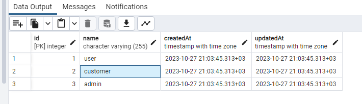
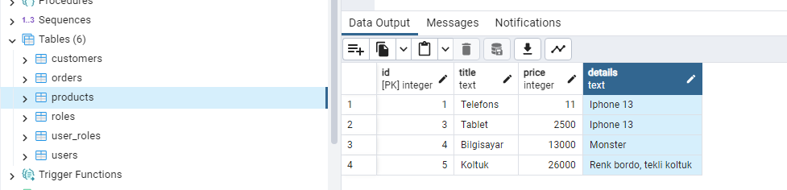
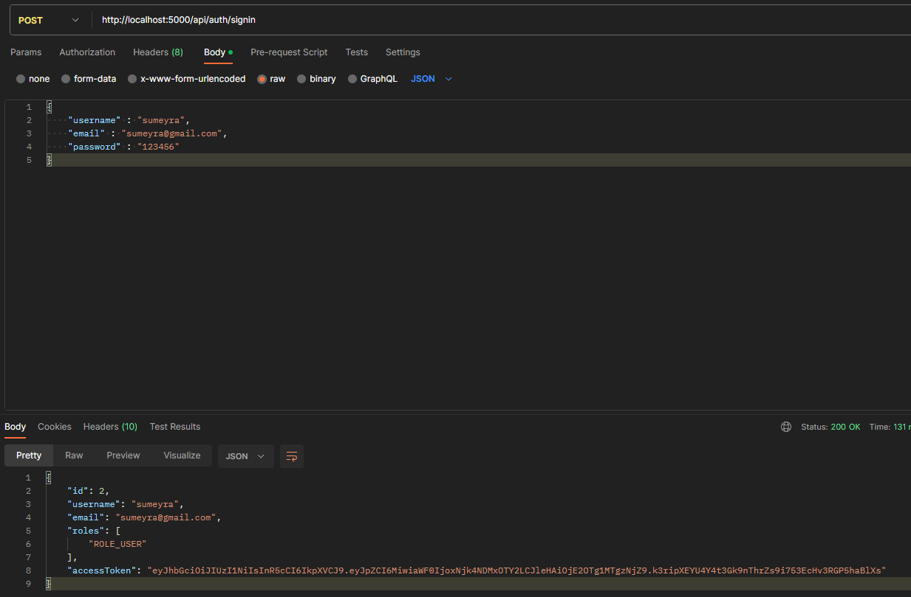

# **Online Shopping Web Application-Backend**

**Node.js – JWT Authentication with PostgreSQL**

## Project setup
 `npm install`

## Run

`node server.js`

Postman collection file has also been uploaded for APIs. 
* [ekinoks.postman_collection.json](ekinoks.postman_collection.json)

Used technologies
* PostgreSQL
* Nodejs
* Express.js
* Postman

#### Roles:

#### An example from the database:

#### Register and Login endpoints for Admins Authentication (for ex. bearer token):

